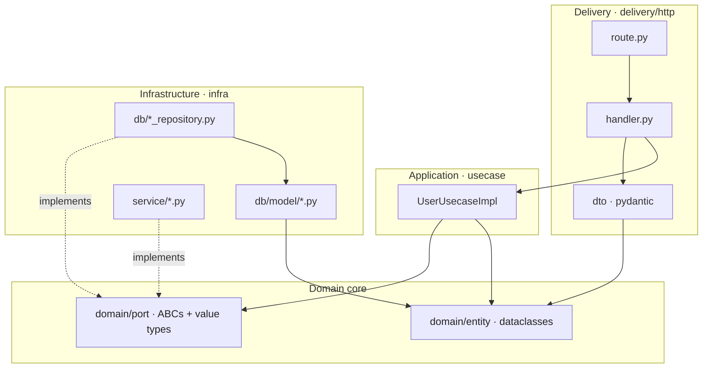
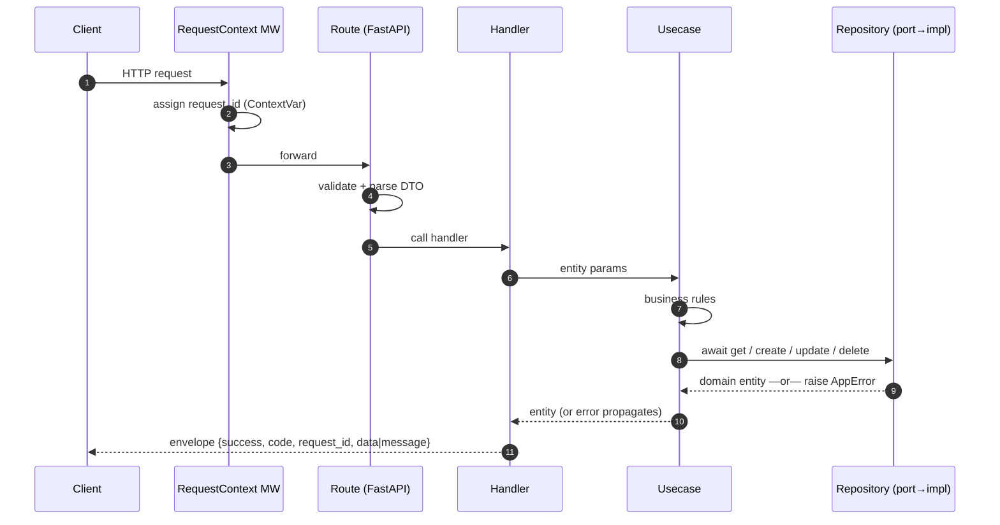
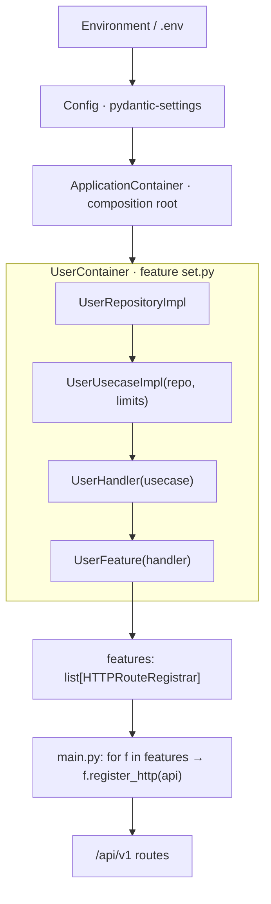

# Python CleanHex Architecture — Code Guidelines

> **A generic FastAPI CleanHex reference** — Clean Architecture + Hexagonal
> (Ports & Adapters), feature-based. Reusable as a starting point for any FastAPI
> BFF or service; nothing here is tied to a specific product or company.
>
> | | |
> |---|---|
> | **Language / framework** | Python 3.11+ · FastAPI · Pydantic v2 · dependency-injector |
> | **Service-specific rules** | This service's `CONVENTIONS.md` |
> | **Scope** | Every feature under `app/internal/feature/` follows this document |
>
> This service is a **BFF** (Backend-for-Frontend): HTTP request in → validate →
> handler → usecase → downstream (mocked here). The demo `user` feature is a full
> RESTful CRUD module backed by a **mocked in-memory repository** so it runs with
> zero external infrastructure.

## Overview

This project follows **CleanHex Architecture** — Clean Architecture + Hexagonal
Architecture (Ports & Adapters) with a **feature-based** modular structure.

> **Coming from a Go CleanHex codebase?** This optional mapping shows the direct
> equivalents. If you are not, skip the table — the rest of the document stands
> on its own.

| Go concept | Python equivalent here |
|---|---|
| `cmd/main.go` | `app/main.py` (FastAPI entrypoint) |
| Wire (`di/`, `set.go`, `wire_gen.go`) | `dependency-injector` container (`app/di/container.py` + feature `set.py`) |
| `wire.Bind(port, impl)` | provider constructs the `*Impl` and feeds it into a constructor typed as the port ABC |
| Go interface (`domain/port`) | `abc.ABC` with `@abstractmethod` |
| Pure struct entity (no tags) | `@dataclass` entity (no pydantic/ORM) |
| GORM model + `ToDomain()` | `@dataclass` model + `to_domain()` in `infra/db/model/` |
| DTO struct + `json`/`validate` tags | `pydantic.BaseModel` |
| echo handler + `utils.ResponseSuccess` | FastAPI route → handler → `utils.response.response_success` |
| `context.Context` propagation | `async`/`await` + request-scoped `ContextVar` |

```
python-clean-hex-bff-api/
├── app/
│   ├── main.py                 # Application entrypoint (FastAPI)
│   ├── di/                     # Dependency Injection (composition root)
│   ├── internal/
│   │   ├── feature/            # Feature modules
│   │   ├── middleware/         # HTTP middlewares
│   │   └── server/             # HTTPRouteRegistrar contract (feature protocol)
│   ├── pkg/                    # Project-specific shared code (config, error_codes)
│   └── utils/                  # Generic reusable library (response, apperror, pagination, request_context)
├── tests/                      # Unit tests, mirroring the source tree
├── requirements.txt
└── ARCHITECTURE.md
```

### `utils/` vs `pkg/` — library code vs project code

Two shared layers sit outside `internal/feature/`. They differ by **who could
reuse them**, not by file size:

| | `app/utils/` | `app/pkg/` |
|---|---|---|
| **Meaning** | Generic **library** — domain-agnostic | **This project's** shared code |
| **Knows the business?** | ❌ Never | ✅ Yes |
| **Copy-paste to another project?** | ✅ As-is | ⚠️ Needs editing |
| **Examples here** | `response`, `apperror` (mechanism + `10xxx`), `pagination`, `request_context` | `config` (this project's env schema), `error_codes` (this project's domain codes) |

**Decision rule:** *"Could I lift this file into an unrelated project untouched?"*
→ **yes** = `utils/`, **no** = `pkg/`.

Consequences worth noting:
- **Pagination** is a pure value object with no business knowledge → `utils/`.
- **Error codes are split by exactly this rule:** the `AppError` classes, the
  resolver, and the cross-cutting `10xxx` codes are generic → `utils/apperror.py`;
  the project's **domain-specific** codes (e.g. `USER_EMAIL_TAKEN = "70001"`) are
  business contract → `app/pkg/error_codes.py`. A feature raises a generic
  subclass and attaches the project code:
  `raise AlreadyExistsError("...", code=error_codes.USER_EMAIL_TAKEN)`.

---

## Architecture at a glance

> Diagrams use [Mermaid](https://mermaid.js.org/) and render on GitHub, GitLab,
> and most Markdown viewers (VS Code needs the Mermaid extension).

### 1. Layers & the dependency rule

Every arrow points **inward**. The outer rings (delivery, infrastructure) depend
on the core (domain); the core depends on nothing framework-specific. Adapters in
`infra/` *implement* the ports the core owns (dashed = "implements").



### 2. Request lifecycle

How a single HTTP call flows through the layers and back out as the standard
envelope.



### 3. Dependency injection (composition root)

Config flows in from the environment; the container builds each feature's object
graph and collects every feature's route registrar, which `main.py` mounts.



Each provider that builds an `*Impl` and feeds it into a constructor typed as the
matching **port ABC** is the binding point — swap an implementation (e.g. mock →
real DB) by changing that one line in `set.py`.

---

## CleanHex Layers

Dependencies always point **inward**. Outer layers depend on inner layers, never
the reverse.

```
┌─────────────────────────────────────────────────────────────────────┐
│                    Frameworks & Drivers (Adapters)                    │
│   infra/db/model/*.py, infra/db/*_repository.py, infra/service/*.py   │
├─────────────────────────────────────────────────────────────────────┤
│                       Interface Adapters                              │
│      delivery/http/ (primary/driving), domain/port/ (secondary)       │
├─────────────────────────────────────────────────────────────────────┤
│                    Application Business (Use Cases)                   │
│                          usecase/*.py                                 │
├─────────────────────────────────────────────────────────────────────┤
│                   Enterprise Business (Pure Domain)                   │
│           domain/entity/*.py (plain dataclasses, no framework)        │
└─────────────────────────────────────────────────────────────────────┘
```

### Key Principles

1. **Pure domain entities** — `@dataclass`, no pydantic, no ORM/serialization.
2. **Explicit ports** — all interfaces are `abc.ABC` in `domain/port/`.
3. **Adapters with mappers** — infra maps to/from the domain in `infra/db/model/`.
4. **Container binding** — the DI container binds each port to its `*Impl`
   (the `wire.Bind` equivalent).

### Layer Responsibilities

| Layer | Folder | Responsibility |
|---|---|---|
| **Entity** | `domain/entity/` | Business objects, self-contained rules |
| **Port** | `domain/port/` | ABC interfaces + domain value types |
| **Use Case** | `usecase/` | Application business logic |
| **Delivery** | `delivery/http/` | Routes, handlers, DTOs |
| **Infrastructure** | `infra/db/`, `infra/service/` | Repositories, external services |

---

## Feature Structure

Every feature follows this layout (see `app/internal/feature/user/`):

```
internal/feature/{feature}/
├── set.py                          # DI container + Feature (route registrar) — the wire set
├── delivery/
│   └── http/
│       ├── handler.py              # HTTP handlers (controllers)
│       ├── route.py                # register_routes(handler) -> APIRouter
│       └── dto/
│           └── {entity}.py         # pydantic requests + responses (one file per entity)
├── domain/
│   ├── entity/
│   │   └── {name}.py               # pure dataclasses (NO pydantic/ORM)
│   └── port/
│       └── {name}.py               # ABC ports + domain value types + filters
├── usecase/
│   └── {name}_usecase.py           # business logic (implements the usecase port)
└── infra/
    ├── db/
    │   ├── model/
    │   │   └── {table}.py          # db model + to_domain() / from_params()
    │   └── {name}_repository.py    # repository implementation
    └── service/                    # external service adapters (optional)
        └── {name}_service.py       # returns domain types, not external types
```

**Infra directory naming:**
- `infra/db/` — repositories (NOT `infra/repository/`)
- `infra/service/` — external service adapters (NOT `infra/adapter/` / `infra/client/`)

### How many features, and what to call them

- **BFF (this service)** splits features by **audience capability / screen**, not
  by downstream service. Hide each backend behind its own port + adapter inside
  the feature.
- Folder = package name = **one lowercase word** when possible (`user`, `setting`,
  `payment`). No two-word concatenations (`useraccount`) unless genuinely one
  indivisible concept.

---

## Naming Conventions

### Files

| Type | Convention | Example |
|---|---|---|
| Entity | `{name}.py` | `user.py` |
| Port | `{feature}.py` | `user.py` |
| Use Case | `{name}_usecase.py` | `user_usecase.py` |
| Repository | `{name}_repository.py` | `user_repository.py` |
| Handler | `handler.py` | `handler.py` |
| Route | `route.py` | `route.py` |
| DTO | `{entity}.py` | `user.py` |
| DB Model | `{table}.py` | `user.py` |

- **DTO:** one file per entity holding ALL request/response models. Do NOT split
  `request.py` / `response.py`.
- **Port:** one file per feature holding ALL ABCs + value types.
- **DB Model:** one file per DB table.

### Python identifiers

| Type | Convention | Example |
|---|---|---|
| Class | PascalCase | `User`, `UserRepository` |
| Port ABC | PascalCase (+ role suffix) | `UserUsecase`, `UserRepository` |
| Implementation | PascalCase + `Impl` | `UserUsecaseImpl`, `UserRepositoryImpl` |
| Method / function | snake_case | `create`, `get_by_id`, `user_response_from_entity` |
| Private attribute | leading underscore | `self._repo`, `self._default_limit` |
| Constant | UPPER_SNAKE | `DEFAULT_LIMIT`, `CODE_NOT_FOUND` |

### Method naming

| Action | Prefix | Example |
|---|---|---|
| Get single | `get` | `get_by_id`, `get_by_email` |
| Get multiple | `list` | `list` |
| Create / Update / Delete | `create` / `update` / `delete` | — |

**Avoid** `get_all_*` / `find_all_*`. **Prefer** `list`.

---

## Configuration Strategy

Every value lives in exactly one place — no scattered magic numbers.

| Criteria | Location | Examples |
|---|---|---|
| Fixed business constant | a `constants` module or `domain/port/` (typed enum) | statuses, enums |
| Tunable per environment | `pkg/config/config.py` (env + default) | limits, timeouts, page sizes |
| Secret / infrastructure | env only (no default in code, or empty default) | DB password, API keys |

Config is a `pydantic-settings.BaseSettings` (`Config`) loaded once via
`provide_config()`.

### Config sources: env-first (why there is no `config.yaml`)

`pydantic-settings` layers config sources for us, so a classic 3-tier strategy
maps onto Python **without a separate `config.yaml`**:

| Tier | Purpose | Where in this project |
|---|---|---|
| Fixed business constant | never changes across environments | module constants / `StrEnum` in `domain/port/` |
| Non-secret tunable + its default | limits, timeouts, page sizes | **field default on the `Config` model** (`pkg/config/config.py`) |
| Secret / per-env override | DB password, API keys, hosts | `.env` + real environment variables (never committed) |

The **field default on the model already is the committed non-secret default** —
so a YAML file would just be a redundant third place. Environment variables
override those defaults; `.env` supplies secrets. This is the FastAPI-idiomatic,
12-factor approach, and it is what this project uses.

**Is TOML "the standard"?** For *project tooling* (build, linters, test config)
yes — that is `pyproject.toml`. For *application runtime* config, **env via
`pydantic-settings` is the standard**, not a TOML/YAML runtime file.

**If you *do* want a committed non-secret config file** (e.g. ops edits tunables
without touching env vars), `pydantic-settings` adds one natively — no feature
code changes, just extend the `Config` sources:

```python
# pkg/config/config.py
from pydantic_settings import (
    BaseSettings, SettingsConfigDict, TomlConfigSettingsSource,
)

class Config(BaseSettings):
    model_config = SettingsConfigDict(env_file=".env", toml_file="config.toml")

    @classmethod
    def settings_customise_sources(cls, settings_cls, init_settings,
                                   env_settings, dotenv_settings, file_secret_settings):
        # precedence (highest → lowest): env → .env → config.toml → model defaults
        return (init_settings, env_settings, dotenv_settings,
                TomlConfigSettingsSource(settings_cls), file_secret_settings)
```

- **TOML** needs no extra dependency (`tomllib` is stdlib on 3.11+).
- **YAML** instead: use `YamlConfigSettingsSource` + `yaml_file="config.yaml"`
  and install `pydantic-settings[yaml]`.
- Keep **secrets in `.env`/env only** — never in the committed TOML/YAML file.

### 🔴 Absolute rule: no `Config` in feature code

Usecases, handlers, repositories, and infra services **never** import
`app.pkg.config`. Config values are extracted as **primitives** at the DI
boundary and injected into constructors.

```python
# feature set.py — the DI boundary extracts config primitives
user_usecase = providers.Singleton(
    UserUsecaseImpl,
    repo=user_repository,
    default_limit=config.DEFAULT_PAGE_SIZE,   # int, not Config
    max_limit=config.MAX_PAGE_SIZE,           # int, not Config
)
```

```python
# usecase — receives primitives only
class UserUsecaseImpl(UserUsecase):
    def __init__(self, repo: UserRepository, default_limit: int, max_limit: int) -> None:
        ...
```

| Layer | May import `pkg/config`? |
|---|---|
| `app/main.py`, `app/di/container.py`, feature `set.py` | ✅ yes (composition root / DI boundary) |
| Usecase / Handler / Repository / Infra / Entity / Port / DTO | ❌ no — receive primitives |

> **Note — `pkg/config` vs the rest of `pkg/`.** The rule above is about
> `pkg/config` specifically, because config is infrastructure and coupling to its
> structure is what we forbid. Other `pkg/` modules that are **pure constants /
> contracts** (e.g. `pkg/error_codes`) may be imported anywhere, including
> usecases and handlers — they carry no infrastructure dependency.

---

## Swapping infrastructure backends (fail-fast startup)

The repository is a **port**, so the concrete backend is a wiring decision — not
a code change in the usecase or handler. This project ships two adapters behind
the one `UserRepository` port and picks between them with an **explicit** config
flag:

```
STORAGE_TYPE=memory     # default — mocked in-memory repo, zero external infra
STORAGE_TYPE=postgres   # real asyncpg adapter, opened + pinged at startup
```

### Why an explicit flag (not "is `DB_HOST` set?")

Never infer the backend from whether a secret happens to be filled in. A typo or
a missing env var in production would then **silently** fall back to the
in-memory repo — data loss with no error. The flag makes intent explicit and
greppable; a misconfigured `postgres` backend fails loudly instead.

### Behaviour

| `STORAGE_TYPE` | At startup | If the DB is unreachable |
|---|---|---|
| `memory` | nothing — no driver import, no connection | n/a |
| `postgres` | open pool + `SELECT 1` ping | **exception propagates → app does not start (fail-fast)** |

Fail-fast at startup beats failing on the first user request: a bad deploy is
caught immediately by the orchestrator's health gate.

### Where each piece lives (respecting the layers)

| Concern | Location |
|---|---|
| The flag + DB tunables | `pkg/config/config.py` (`STORAGE_TYPE`, `DB_*`) |
| Async pool holder (lazy `asyncpg` import) | `pkg/database.py` — constructed sync, connected async |
| Adapter selection | feature `set.py` via `providers.Selector(config.STORAGE_TYPE, ...)` |
| Opening + pinging the pool | `app/main.py` lifespan (composition root only) |
| The adapters | `infra/db/user_repository.py` (memory) · `infra/db/user_repository_postgres.py` |

The pool is created in the **async lifespan** (not at import time) and stored in
a holder that repositories read at query time — so the synchronous DI graph can
still be built at import while the connection stays async and fail-fast. No inner
layer imports `pkg/config`; `main.py` extracts primitives and calls
`database.connect(...)`.

```python
# feature set.py — one port, two adapters, chosen by the flag
user_repository = providers.Selector(
    config.STORAGE_TYPE,
    memory=providers.Singleton(UserRepositoryImpl),
    postgres=providers.Singleton(UserRepositoryPostgres, db=database),
)
```

`asyncpg` is imported lazily inside `Database.connect`, so the default `memory`
demo needs neither the driver nor a running database.

---

## Entity vs DB Model vs DTO

### Entity (`domain/entity/`) — pure domain

- Plain `@dataclass`. **NO pydantic, NO ORM/serialization concerns.**
- Holds self-contained business rules (`user.can_be_deleted()`).

```python
@dataclass
class User:
    id: int
    name: str
    email: str
    status: str
    created_at: datetime
    updated_at: datetime

    def can_be_deleted(self) -> bool:
        return self.status != "active"
```

### DB Model (`infra/db/model/`) — persistence shape

- `@dataclass` shaped like the row. **Mapping happens here, at the boundary** —
  never inline in the repository method.
- `to_domain()` (SELECT → entity), `from_params()` / `with_updates()` (write side).

```python
@dataclass
class UserModel:
    id: int; name: str; email: str; status: str
    created_at: datetime; updated_at: datetime

    def to_domain(self) -> User: ...
    @staticmethod
    def from_params(new_id: int, params: CreateUserParams, now: datetime) -> "UserModel": ...
```

### DTO (`delivery/http/dto/`) — HTTP shape

- `pydantic.BaseModel` with validation (`Field`, `EmailStr`, constraints).
- **Request DTOs do NOT import the entity.** The handler extracts values and
  builds `entity.*Params`.
- **Response DTOs** import the entity only for `..._from_entity()` **standalone
  factory functions** (not methods) that only format/transform data.

```python
def user_response_from_entity(user: User) -> UserResponse:  # standalone, not a method
    return UserResponse(id=user.id, name=user.name, ...)
```

---

## Handler Rules

- Handler imports: `dto`, `port`, `utils`. **NOT** the repository, **NOT** the
  entity directly (use the DTO `from_entity` factories).
- Bind/extract request → call the usecase port → shape the envelope.
- Never put a `for` loop entity→DTO in the handler; use `..._responses_from_entities()`.

Domain errors raised by the usecase are `AppError` subclasses that already carry
their HTTP status and 5-digit code, so a single `_map_error` converts any of them:

```python
async def create(self, req: CreateUserRequest) -> JSONResponse:
    try:
        user = await self._uc.create(
            CreateUserParams(name=req.name, email=str(req.email), status=req.status.value)
        )
    except Exception as err:
        return _map_error(err, "failed to create user")
    return response_success(
        user_response_from_entity(user).model_dump(mode="json"),
        http_code=HTTPStatus.CREATED,
    )
```

---

## Port (Interface) Rules

- Ports live in `domain/port/` as `abc.ABC` with `@abstractmethod`.
- **Domain value types** (typed constants) live in `domain/port/`, NOT in
  `domain/entity/`. Port is the contract layer every layer may import.
- Use **params dataclasses** (`CreateUserParams`, `UpdateUserParams`) when a
  method has many fields, instead of long positional signatures.

```python
class UserStatus(StrEnum):          # domain value type — in port
    ACTIVE = "active"
    INACTIVE = "inactive"
    SUSPENDED = "suspended"

class UserRepository(ABC):          # secondary port (driven)
    @abstractmethod
    async def get_by_id(self, user_id: int) -> User: ...

class UserUsecase(ABC):             # primary port (driving)
    @abstractmethod
    async def create(self, params: CreateUserParams) -> User: ...
```

### External service best practices

Resilience (retry, timeout, circuit-breaking) and response mapping stay in
`infra/service/` — never in the usecase. Service adapters return **domain
types**, not external client types.

---

## Cross-Feature Rules

### 🔴 Zero cross-feature imports

**No module in `internal/feature/X/` may import from `internal/feature/Y/`.** The
only place features meet is the composition root (`app/di/container.py`).

- If two features need shared behaviour → put it in `app/pkg/` (project-specific)
  or `app/utils/` (generic, domain-agnostic) and both import it — never
  feature-to-feature.
- If a feature needs another feature's data → its own repository reads that data
  source directly (no cross-feature import).

### Composition root import rule

`app/di/container.py` imports only each feature's `set.py` (feature root) — never
its inner `usecase` / `infra` / `port` modules.

---

## Layer Import Restrictions

| Layer | ✅ CAN import | ❌ CANNOT import |
|---|---|---|
| **Entity** | stdlib, `utils.apperror` | pydantic, config, port, usecase, infra, dto |
| **Port** | entity, `utils.pagination`, stdlib | pydantic, config, usecase, infra, dto |
| **Usecase** | entity, port, `utils.apperror`, `pkg.error_codes`, stdlib | `pkg.config`, dto, infra, db model, fastapi |
| **Handler** | dto, port, utils, `pkg.error_codes`, fastapi | infra, db model, `pkg.config` |
| **DTO** | entity (response only), pydantic, `utils.pagination` | config, infra, usecase |
| **Repository** | entity, db model, apperror | config, dto, fastapi |
| **Infra Service** | port (types), apperror, external libs | config, dto, fastapi |
| **DB Model** | entity | config, port, dto, usecase, fastapi |
| **set.py** | config, port, usecase, infra, delivery, dependency-injector | — |

```
Entity ← Port ← Usecase ← Handler
                  ↑          ↑
                Infra       DTO
                  ↑
                Model
```

---

## Error Handling

Domain errors are `AppError` subclasses in `app/utils/apperror.py`. Each carries a
default HTTP status and a stable **5-digit `code`** — a permanent, append-only,
machine-readable contract that frontends map to i18n messages (they must never
string-match `message`).

```
Repository (infra error) → raise domain AppError → Usecase (propagates) → Handler maps → envelope
```

- **Repository** translates "row missing" into `NotFoundError` — the usecase never
  sees infrastructure-specific errors.
- **Usecase** raises domain errors (`BadRequestError`, `AlreadyExistsError`,
  `ConflictError`, …); it may attach a project domain-specific code from
  `app/pkg/error_codes.py` (`code=error_codes.USER_EMAIL_TAKEN`).
- **Handler / global exception handlers** convert `AppError` and validation errors
  into the standard envelope. Never leak a raw exception to the client.

---

## Response Envelope

Every response body carries `success`, a 5-digit `code`, and (when known)
`request_id`. Frontends map `code` → i18n and must never string-match `message`.

```json
{ "success": true,  "status": "ok", "code": "00000", "data": {}, "request_id": "…" }
{ "success": false, "code": "10004", "message": "user not found", "request_id": "…" }
```

Use `response_success(...)` and `response_error(...)` from `app/utils/response.py`.
The `request_id` is set per request by `RequestContextMiddleware` and read back via
a `ContextVar` (the Go `httplog.RequestID(ctx)` equivalent).

---

## OpenAPI / Swagger

Interactive API docs are **built into FastAPI** — no annotations tool like Go's
`swag init`, and nothing to regenerate or commit. FastAPI derives the OpenAPI
schema at runtime from your route signatures and pydantic DTOs.

### Endpoints (gated by `ENABLE_DOCS`)

| URL | What |
|---|---|
| `/docs` | Swagger UI (try-it-out) |
| `/redoc` | ReDoc (clean reference) |
| `/openapi.json` | Raw OpenAPI 3.x schema |

`app/main.py` wires these off the `ENABLE_DOCS` flag so they can be disabled in
production:

```python
app = FastAPI(
    title="Python CleanHex BFF API", version="1.0.0",
    docs_url="/docs"        if cfg.ENABLE_DOCS else None,
    redoc_url="/redoc"      if cfg.ENABLE_DOCS else None,
    openapi_url="/openapi.json" if cfg.ENABLE_DOCS else None,
)
```

### What the schema captures automatically

| Source in code | Shows up in Swagger as |
|---|---|
| DTO request model (`CreateUserRequest`) + `Field(...)` constraints | request body schema + validation rules |
| `Query()` / `Path(ge=1)` params | typed, validated query/path params |
| `tags=[...]`, `summary=`, `description=` on the route | grouping + human text |
| `status_code=201` | documented success status |
| `RequestValidationError` handler | `422` behaviour (shape shown once documented — below) |

### Documenting the response **envelope**

Handlers return `JSONResponse` (the standard envelope) directly, so FastAPI
cannot infer the response body shape on its own. This project therefore ships
**docs-only envelope models** in `app/utils/openapi.py` and attaches them with
`response_model` / `responses=`. Returning a `Response` instance bypasses
`response_model` serialization, so this is **documentation-only** and never
changes runtime behaviour:

```python
# app/utils/openapi.py — generic, reusable envelope models for docs
from typing import Generic, TypeVar
from pydantic import BaseModel

T = TypeVar("T")

class SuccessEnvelope(BaseModel, Generic[T]):
    success: bool = True
    status: str = "ok"
    code: str = "00000"
    data: T | None = None
    request_id: str | None = None

class ErrorEnvelope(BaseModel):
    success: bool = False
    code: str = "10004"
    message: str = "resource not found"
    request_id: str | None = None
```

```python
# route.py — document the contract; the return value is still a JSONResponse
@router.get(
    "/{user_id}",
    summary="Get a user by ID",
    response_model=SuccessEnvelope[UserResponse],
    responses={404: {"model": ErrorEnvelope}},
)
async def get_user(user_id: Annotated[int, Path(ge=1)]):
    return await handler.get(user_id)   # still returns JSONResponse
```

> Envelope models live in a docs-only module (`app/utils/openapi.py`); they
> describe the contract, they are **not** the objects handlers build.

### Extra metadata knobs

- App-level: `title`, `version`, `description`, `contact`, `license_info`,
  `servers=` on `FastAPI(...)`.
- Route-level: `summary`, `description` (Markdown), `tags`, `deprecated=True`,
  `responses={...}`, and per-field `examples` on DTO `Field(...)`.

---

## Async & Request Context

FastAPI is `async`-first. This replaces Go's explicit `context.Context`:

1. **All I/O methods are `async def`** across handler → usecase → repository.
2. **Never block the event loop** — no synchronous network/disk in an `async`
   path; offload CPU-bound work to a thread/process pool.
3. **Request-scoped values** (request id) flow through a `ContextVar` set by
   middleware, not through hand-threaded parameters.

```python
async def get(self, user_id: int) -> User:
    return await self._repo.get_by_id(user_id)   # await downstream I/O
```

---

## Logging

One setup, two output modes — chosen by config so the same code runs in dev and
prod (`app/utils/logging_config.py`, stdlib only, no extra dependency):

| `LOG_FORMAT` | Output | Use |
|---|---|---|
| `console` (default) | `2026-01-01 09:00:00 INFO app [req-id] message` | local development |
| `json` | `{"timestamp":"…","level":"INFO","logger":"…","message":"…","request_id":"…"}` | production — ship straight to CloudWatch / Elastic / Loki, no parser |

`LOG_LEVEL` (default `INFO`) sets the threshold.

### How it works

- `configure_logging(level, fmt)` is called once at the top of `create_app()`.
  It installs a **single root handler** writing to stdout (12-factor: the
  platform collects stdout), then routes uvicorn/fastapi loggers through it so
  **all logs share one format**. On a TTY the console level tag is colorized
  (INFO green, WARNING yellow, ERROR red); piped/JSON output stays plain.
- A `RequestIdFilter` stamps every record with the request id from the
  request-context `ContextVar`, so log lines correlate with the `request_id` in
  the response envelope.
- **Access log:** `AccessLogMiddleware` emits one structured line per request
  (`method`, `path`, `status`, `latency_ms`, `request_id`); uvicorn's own access
  logger is disabled to avoid duplicates. `/health` is skipped. It sits inside
  `RequestContextMiddleware` so the request id is set before it logs.
- `main()` runs uvicorn with `log_config=None` so uvicorn does not reset logging
  back to its own text format.

```text
2026-01-01 09:00:00 INFO     access [a1b2c3] POST /api/v1/users -> 201 (3.14ms)
```

### Rule: don't scatter `logger.error(...)`

Errors bubble up to the exception handlers, which call `response_error(...)` —
that is the one place an error is logged (`app/utils/response.py`). Handlers,
usecases, and repositories **return/raise** errors; they do not log. Use a
logger directly only for background work with no request in flight.

**Level by status code** (so expected outcomes don't spam logs / trip alerts):

| Status | Level | Stack trace? |
|---|---|---|
| `5xx` (unexpected server fault) | `ERROR` | yes (`exc_info`) |
| `4xx` (expected client/business: 404, 409, 401, …) | `WARNING` | no |

Each logged error is tagged with the **HTTP status** and the **5-digit code** —
inline in the console message (`http error [409 70001]: …`) and as dedicated
`status` / `code` fields in JSON, so log shippers can filter/aggregate on them:

```text
# console
2026-01-01 09:00:00 WARNING  python-clean-hex-bff-api [a1b2c3] http error [409 70001]: email already registered
```

```json
// production (LOG_FORMAT=json) — one object per line, ready for log shippers
{"timestamp":"2026-01-01T09:00:00Z","level":"WARNING","logger":"python-clean-hex-bff-api","message":"http error [409 70001]: email already registered","request_id":"a1b2c3","status":409,"code":"70001"}
```

### Sensitive data

- **Access metadata** (method, path, status, latency, request id) is logged by
  `AccessLogMiddleware` — safe, no bodies.
- **Request/response bodies are OFF by default** — they may carry passwords,
  tokens, or PII. Set `LOG_BODIES=true` to enable body logging as a debugging
  aid (`BodyLogMiddleware`): bodies are passed through `redact(...)` and
  truncated to `LOG_BODY_MAX_BYTES`. Keep it off in production.
- **Redaction toggle** (`LOG_REDACT`, default `true`): masking of logged bodies
  is ON by default (secure). On a trusted local machine you may set
  `LOG_REDACT=false` to inspect **raw** values while debugging — the app logs a
  warning at startup so this never slips into a deployed server. This is an
  explicit flag (like `STORAGE_TYPE`), not inferred from `ENVIRONMENT`. It only
  affects body logging; the `422` sanitization below always applies.
- **Universal vs project secret keys** (same split as `apperror` vs
  `error_codes`): generic keys (`password`, `token`, …) live in
  `utils/redact.py`; **project-specific** field names live in
  `pkg/sensitive_keys.py` and are passed via `extra_keys`
  (`redact(body, extra_keys=sensitive_keys.SENSITIVE_KEYS)`). `utils` never
  imports `pkg`.
- **Validation errors are sanitized**: the `422` handler returns only
  `loc` / `msg` / `type`, dropping pydantic's raw `input` (and docs `url`) so a
  bad `password`/`token` field is never echoed to the client or logs.

```python
from app.utils.redact import redact
redact({"name": "Alice", "password": "hunter2"})
# -> {"name": "Alice", "password": "[REDACTED]"}

# keep head + tail (mask the middle) for verification-friendly fields
redact({"card": "4242424242424242"}, partial_keys={"card"})
# -> {"card": "4242***4242"}
```

---

## Validation

| Type | Location | Examples |
|---|---|---|
| **Format validation** | DTO (pydantic `Field`, `EmailStr`, constraints) | required, email, length, range |
| **Business validation** | Usecase (needs a lookup) or Entity (self-contained) | duplicate email, status transition |

FastAPI raises `RequestValidationError` for format problems; the global handler
maps it to a `10003` (`422`) envelope.

---

## Dependency Injection (dependency-injector)

`dependency-injector` is the composition-root equivalent of Wire.

### Feature `set.py` = the wire set

```python
class UserContainer(containers.DeclarativeContainer):
    config = providers.Configuration()

    user_repository = providers.Singleton(UserRepositoryImpl)          # -> port.UserRepository
    user_usecase = providers.Singleton(
        UserUsecaseImpl,
        repo=user_repository,
        default_limit=config.DEFAULT_PAGE_SIZE,
        max_limit=config.MAX_PAGE_SIZE,
    )                                                                   # -> port.UserUsecase
    handler = providers.Singleton(UserHandler, usecase=user_usecase)
    feature = providers.Singleton(UserFeature, handler=handler)        # route registrar
```

- Each `providers.*` that builds an `*Impl` and feeds it into a constructor typed
  as the matching port ABC **is** the `wire.Bind(port, impl)` equivalent.
- To swap an implementation (e.g. mock → real DB), change the provider here only.
- Config primitives are extracted here (the `ProvideXxx` wrapper equivalent).

### Composition root (`app/di/container.py`) = `di/set.go` + `wire_gen.go`

```python
class ApplicationContainer(containers.DeclarativeContainer):
    config = providers.Configuration()
    user = providers.Container(UserContainer, config=config)   # mount feature sub-container
    features = providers.List(user.feature)                    # -> [HTTPRouteRegistrar]
```

`app/main.py` then loops the collected features and mounts each one — the Python
equivalent of Go's `for _, f := range features { f.RegisterHTTP(api) }`.

### Adding a new feature

1. Create the feature tree + its `set.py` (`{X}Container` + `{X}Feature`).
2. Add `x = providers.Container(XContainer, config=config)` to `ApplicationContainer`.
3. Append `x.feature` to `features`.
4. No code generation step — the container is declarative and resolved at startup.

---

## Testing

### Philosophy

Standard `pytest` + **function-field mocks** for ports (no `unittest.mock`
patching of internals, no auto-mock frameworks). Unit tests only — never touch a
real DB/Redis/network.

### Placement (mirrors the source tree under `tests/`)

```
tests/feature/user/
├── usecase/user_usecase_test.py     # business rules + every error path (mock repo)
└── delivery/http/handler_test.py    # status codes + envelope (mock usecase, TestClient)
```

### Mock pattern (function fields)

```python
class MockUserRepository(UserRepository):
    def __init__(self) -> None:
        self.get_by_id_fn = None
    async def get_by_id(self, user_id: int) -> User:
        return self.get_by_id_fn(user_id) if self.get_by_id_fn else _user(user_id)
```

### What to test per layer

| Layer | Priority | Verify | Mock |
|---|---|---|---|
| **Usecase** | Must | business rules, all error paths, edge cases | repository / service ports |
| **Handler** | Should | request binding, status codes, envelope shape | usecase port |
| **Repository / Infra** | Excluded from unit tests | needs real infra | — |
| **Entity** | If it has methods | pure domain logic | none |

### Running

```bash
.venv/bin/python -m pytest -q            # all tests
.venv/bin/python -m pytest tests/feature/user -q
```

---

## Checklist: Creating a New Feature (CleanHex)

### Structure & implementation
1. [ ] Create `internal/feature/{name}/` tree
2. [ ] Pure entities in `domain/entity/` (dataclasses, no pydantic/ORM)
3. [ ] Ports + domain value types in `domain/port/` (ABC + `StrEnum`)
4. [ ] DB models in `infra/db/model/` with `to_domain()` / `from_params()`
5. [ ] Repository in `infra/db/` (maps at boundary, raises domain errors)
6. [ ] External service adapters in `infra/service/` (return domain types)
7. [ ] Usecase in `usecase/` (no infra/config imports)
8. [ ] DTOs in `delivery/http/dto/{entity}.py` (pydantic)
9. [ ] Handler in `delivery/http/handler.py`
10. [ ] `register_routes()` in `delivery/http/route.py`

### Dependency injection
11. [ ] `set.py`: `{X}Container` + `{X}Feature`
12. [ ] Mount in `app/di/container.py` and append to `features`

### Critical rules
13. [ ] **Async everywhere:** all I/O methods `async def`, always `await` downstream
14. [ ] **Error mapping:** repository maps missing/duplicate to `AppError` — no infra errors in usecase
15. [ ] **No `Config` in feature code:** primitives injected via `set.py`
16. [ ] **Handler → entity isolation:** handler uses `dto.*_from_entity()`, not the entity directly
17. [ ] **Cross-feature isolation:** no `internal/feature/X` imports `internal/feature/Y`
18. [ ] **Domain value types in `domain/port/`**, not in `domain/entity/`
19. [ ] **5-digit `code`** on every envelope; generic codes in `utils/apperror.py`, project domain codes appended to `pkg/error_codes.py`
20. [ ] **Validation split:** format in DTO, business in usecase/entity

### Testing
21. [ ] Usecase tests (mock repo) + handler tests (mock usecase)
22. [ ] Function-field mocks, no third-party mock framework
23. [ ] `pytest -q` passes
