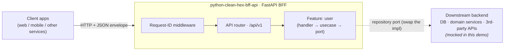

# python-clean-hex-bff-api

A **generic, reusable FastAPI** reference BFF (Backend-for-Frontend) built with
**CleanHex** architecture — Clean Architecture + Hexagonal (Ports & Adapters),
feature-based. It ships one full RESTful CRUD module — `user` — backed by a
**mocked in-memory repository**, so it runs with zero external infrastructure.
Copy it as a starting point for any FastAPI service.

- Architecture + diagrams: [`ARCHITECTURE.md`](./ARCHITECTURE.md)
- Service conventions: [`CONVENTIONS.md`](./CONVENTIONS.md)

## System overview



The BFF only depends on **ports** (interfaces). The concrete backend lives behind
a repository/service adapter, so you can start with the in-memory mock and later
bind a real database or downstream service without touching the handler or usecase.

## Stack

- Python 3.11+ · FastAPI · Pydantic v2 · pydantic-settings
- `dependency-injector` for the DI composition root
- `pytest` for unit tests (function-field mocks, no real infra)

## Layout

```
app/
├── main.py                     # FastAPI entrypoint (composition + route mounting)
├── di/container.py             # composition root (wires features + shared infra)
├── internal/
│   ├── server/module.py        # HTTPRouteRegistrar protocol (feature contract)
│   ├── middleware/             # request-id middleware
│   └── feature/user/           # the demo CRUD feature
│       ├── set.py              # feature DI container + route registrar
│       ├── domain/entity/      # pure dataclasses
│       ├── domain/port/        # ABC ports + domain value types
│       ├── usecase/            # business logic
│       ├── delivery/http/      # handler, route, dto
│       └── infra/db/           # mocked repository + db model
├── pkg/                        # project-specific shared code: config, error_codes, sensitive_keys
└── utils/                      # generic reusable library: response, apperror, pagination, request_context
tests/                          # unit tests, mirroring app/
```

## Make targets

Common tasks are wrapped in a `Makefile` (run `make help` to list them):

| Target | Does |
|---|---|
| `make install` | Create `.venv` + install runtime & dev deps |
| `make run` | Run the API with autoreload (`make run PORT=9000` to override) |
| `make test` | Run unit tests |
| `make check` | Lint + tests together (CI gate) |
| `make lint` / `make format` | Ruff lint / auto-format |
| `make openapi` | Export the OpenAPI schema to `openapi.json` |
| `make clean` | Remove caches and the exported schema |

Interpreter/env are overridable, so you can switch without editing the Makefile:

```bash
make install PYTHON=python3.12   # build the venv with a specific interpreter
make test    VENV=/path/to/env   # use an existing environment
make test    PY=python3          # bypass the venv (system python)
make run     PORT=9000           # override the port
```

## Setup

```bash
cd python-clean-hex-bff-api
make install
# or, without make:
python3 -m venv .venv && .venv/bin/pip install -r requirements.txt
```

## Run

```bash
make run
# or, without make:
.venv/bin/uvicorn app.main:app --reload --port 8080
.venv/bin/python -m app.main
```

- Swagger UI: <http://localhost:8080/docs>
- ReDoc: <http://localhost:8080/redoc>
- OpenAPI schema: <http://localhost:8080/openapi.json>
- Health check: <http://localhost:8080/health>

> API docs are built into FastAPI and toggled by the `ENABLE_DOCS` flag
> (default on). See `ARCHITECTURE.md` § OpenAPI / Swagger.

## Docker

```bash
docker build -t python-clean-hex-bff-api .
docker run --rm -p 8080:8080 python-clean-hex-bff-api
```

Runs the mocked in-memory backend by default (zero external infra). To use
PostgreSQL, pass env at runtime:

```bash
docker run --rm -p 8080:8080 \
  -e STORAGE_TYPE=postgres \
  -e DB_HOST=host.docker.internal -e DB_NAME=app_db \
  -e DB_USER=app -e DB_PASSWORD=secret \
  python-clean-hex-bff-api
```

## API (demo `user` module)

Base path: `/api/v1`

| Method | Path | Description |
|---|---|---|
| GET | `/users` | List users (search / status / sort / limit / offset) |
| GET | `/users/{id}` | Get one user |
| POST | `/users` | Create a user |
| PUT | `/users/{id}` | Update a user (partial) |
| DELETE | `/users/{id}` | Delete a user (blocked while `active`) |

Every response uses the standard envelope with a 5-digit `code` and `request_id`:

```json
{ "success": true,  "status": "ok", "code": "00000", "data": { ... }, "request_id": "…" }
{ "success": false, "code": "10004", "message": "user not found", "request_id": "…" }
```

### Examples

```bash
curl localhost:8080/api/v1/users
curl localhost:8080/api/v1/users/1
curl -X POST localhost:8080/api/v1/users \
  -H 'Content-Type: application/json' \
  -d '{"name":"Dana","email":"dana@example.com","status":"active"}'
curl -X PUT localhost:8080/api/v1/users/2 -H 'Content-Type: application/json' -d '{"name":"Bruno C."}'
curl -X DELETE localhost:8080/api/v1/users/2
```

## Test

```bash
make test
# or, without make:
.venv/bin/python -m pytest -q
```

## Configuration

Copy `.env.example` to `.env`. All values have safe defaults; the demo needs no
real database. See `app/pkg/config/config.py` and `ARCHITECTURE.md`
§ Configuration Strategy.

### Storage type (`STORAGE_TYPE`)

| Value | Behaviour |
|---|---|
| `memory` (default) | Mocked in-memory repo — no DB, nothing to connect. |
| `postgres` | Real `asyncpg` adapter. The pool is opened and pinged at startup, so an unreachable/misconfigured DB makes the app **fail fast** (it won't start). Fill in the `DB_*` vars. |

The backend is an **explicit flag**, never inferred from whether `DB_*` is set —
see `ARCHITECTURE.md` § Swapping infrastructure backends.

### Logging (`LOG_FORMAT`)

| Value | Output |
|---|---|
| `console` (default) | Human-readable one-liner for local dev. |
| `json` | One JSON object per line — ship straight to CloudWatch / Elastic / Loki. |

`LOG_LEVEL` (default `INFO`) sets the threshold. Every line carries `request_id`.
In production set `LOG_FORMAT=json`. See `ARCHITECTURE.md` § Logging.

Body logging is opt-in: `LOG_BODIES=true` logs request/response bodies (debug
aid, truncated to `LOG_BODY_MAX_BYTES`). Sensitive fields are masked by default;
`LOG_REDACT` (default `true`) toggles that masking — set `LOG_REDACT=false` only
on a trusted local machine to see raw values. Keep both safe in production.
